# Plan d'amélioration UX/UI – Le Monde en Vrai

## Contexte actuel

- **Stack** : React, Vite, Tailwind, Leaflet, Zustand.
- **Écrans** : carte mondiale avec pins pays (capitales), panel latéral (pays/ville), header (recherche, style carte, aléatoire, Découvertes), drawer « Mes découvertes ».
- **Points déjà solides** : skeleton loading, animations (slide-in, fade), scrollbar custom, focus trap dans le drawer, clavier dans la recherche, breadcrumb.

---

## 1. Feedback utilisateur et états manquants

**Problème** : Clic sur un pays absent de `countries.sample.json` (GeoJSON uniquement) ne donne aucun retour.

- **Action** : Dans [App.tsx](src/App.tsx), dans `handleCountryClick`, si `countriesData.countries.find(...)` est `undefined`, afficher un message discret (toast ou bandeau temporaire) du type « Ce pays n’est pas encore dans notre base » et ne pas ouvrir le panel.
- **Option** : Petit composant toast réutilisable (état dans le store ou contexte) pour réutiliser ailleurs (ex. « Ajouté aux découvertes »).

**Problème** : Pas de confirmation visuelle après « Ajouter à Mes découvertes ».

- **Action** : Dans [CountryPanel.tsx](src/components/panels/CountryPanel.tsx) et [CityPanel.tsx](src/components/panels/CityPanel.tsx), après `addDiscovery`, déclencher un toast « Ajouté à Mes découvertes » ou une micro-animation sur le bouton (icône check + texte « Ajouté » 1–2 s puis retour à l’état sauvegardé).

**Problème** : Bouton « Quiz (bientôt) » occupe de la place et est toujours désactivé.

- **Action** : Soit le retirer, soit le remplacer par un simple lien texte discret « Quiz (bientôt) » en bas du panel pour libérer de l’espace.

---

## 2. Navigation et contexte

**Breadcrumb peu exploitable** : Seul « Monde » est cliquable ([Breadcrumb.tsx](src/components/header/Breadcrumb.tsx)).

- **Action** : Rendre chaque segment cliquable : « Monde » → `clearSelection` ; « Pays » → garder pays, `setSelectedCity(null)` ; « Ville » → garder ville (déjà le contexte). Ainsi on peut revenir au pays depuis une ville sans tout fermer.

**Panel mobile (72vh)** : Pas d’indication que le panel est « tirable » ou fermable vers le bas.

- **Action** : Ajouter une poignée visuelle (petite barre centrée en haut du panel) et, si souhaité, un geste swipe-down pour fermer le panel (optionnel, plus complexe). Au minimum la poignée + texte/aria « Glisser pour fermer » améliore la découverte.

**Drawer Découvertes – clic sur une ville** : [DiscoveriesDrawer.tsx](src/components/discoveries/DiscoveriesDrawer.tsx) : pour une ville, seul `toggleDrawer()` est appelé ; pas de zoom ni d’ouverture du panel ville.

- **Action** : Pour `discovery.type === 'city'`, retrouver la ville dans `cities.sample.json`, appeler `setSelectedCity(city)` et `setSelectedCountry(country)` si besoin, ouvrir le panel (`setPanelOpen(true)`), puis fermer le drawer. Optionnel : centrer la carte sur la ville (bounds ou flyTo) pour renforcer le contexte.

---

## 3. Carte (WorldMap)

**Pins pays sans indication au survol** : On ne sait pas quel pays on s’apprête à cliquer.

- **Action** : Dans [WorldMap.tsx](src/components/map/WorldMap.tsx), ajouter un tooltip Leaflet (ou attribut `title`) sur chaque `Marker` pays avec le nom du pays (et éventuellement la capitale). Utiliser `L.tooltip` ou le composant Tooltip de react-leaflet si disponible, sinon `title` sur l’icône.

**Pays sélectionné peu visible sur la carte** : Les polygones GeoJSON restent très discrets ; la sélection ne se voit qu’au pin.

- **Action** : Lorsqu’un `selectedCountry` a un `bounds` (ou un code correspondant à un feature), appliquer un style différent au feature GeoJSON correspondant (contour plus épais, `fillOpacity` légèrement plus élevé) pour mettre en évidence le pays sélectionné. Nécessite de garder une ref des layers par `ISO_A2` / `ISO_A2_EH` et de mettre à jour le style dans un `useEffect` dépendant de `selectedCountry`.

---

## 4. Panels (pays et ville)

**Galerie d’images pays** : [CountryPanel.tsx](src/components/panels/CountryPanel.tsx) : défilement horizontal sans indicateurs (nombre d’images, position).

- **Action** : Ajouter des indicateurs (points ou « 1/3 ») sous la galerie. Optionnel : flèches prev/next sur les bords (masquées sur très petit écran) et/ou lightbox au clic sur une image.

**Densité d’information** : Beaucoup de blocs (stats, saison, prix, curiosité, anecdotes, villes, actions).

- **Action** : Rendre les sections « Anecdotes » et « Villes à explorer » repliables (bouton « Afficher plus / moins » ou accordéon) avec un aperçu (ex. première ligne + « 4 autres ») pour alléger la première vue tout en gardant l’accès au détail.

**CityPanel** : Contenu limité (faits + sauvegarder).

- **Action** : Ajouter un lien ou bouton « Voir le pays » qui appelle `setSelectedCity(null)` pour revenir au panel pays sans fermer le panel, et améliorer la hiérarchie visuelle (séparateur, sous-titre « Dans [Pays] »).

---

## 5. Header et recherche

**Header sur petit écran** : Beaucoup d’éléments (logo, search, style carte, aléatoire, Découvertes) ; le breadcrumb est déjà masqué sur sm.

- **Action** : Sur mobile (ex. `< md`), regrouper « Style carte » et « Aléatoire » dans un menu burger ou un dropdown « Plus » pour garder le header lisible, avec la recherche et « Découvertes » prioritaires.

**Recherche** : Déjà bonne (clavier, aria). Amélioration possible : afficher 1–3 « Pays récents » ou « Découvertes récentes » quand le champ est focus et vide pour raccourcir les parcours répétés.

---

## 6. Accessibilité

- **Focus visible** : Vérifier que tous les boutons et liens ont un `focus:ring-2` (ou équivalent) visible ; compléter dans [index.css](src/index.css) ou Tailwind si des composants (Leaflet, div cliquables) n’héritent pas du style.
- **Announces** : Ajouter une zone `aria-live="polite"` (ex. dans [App.tsx](src/App.tsx) ou un composant dédié) qui annonce brièvement « [Nom du pays] sélectionné » ou « Panel [pays] ouvert » quand `selectedCountry` / `selectedCity` change, pour les utilisateurs de lecteurs d’écran.
- **Drawer** : S’assurer que la touche Escape ferme bien le drawer (déjà fait) et que le focus revient sur le bouton « Découvertes » à la fermeture.

---

## 7. Cohérence visuelle et vides

- **États vides** : Unifier le style (icône + titre + courte phrase) pour « Aucune découverte », « Aucun résultat » recherche, et éventuellement « Aucune ville » dans le panel pays.
- **Design tokens** : Vérifier les rayons (rounded-xl / rounded-2xl), espacements (p-4 / p-6) et ombres entre panel, drawer et cartes pour une cohérence globale.

---

## Ordre de mise en œuvre suggéré

```mermaid
flowchart LR
  subgraph phase1 [Phase 1 - Feedback]
    A[Toast / message pays inconnu]
    B[Confirmation ajout découverte]
    C[Breadcrumb cliquable]
  end
  subgraph phase2 [Phase 2 - Carte et navigation]
    D[Tooltip sur pins pays]
    E[Highlight pays sélectionné]
    F[Drawer ville -> panel + carte]
  end
  subgraph phase3 [Phase 3 - Panels et header]
    G[Indicateurs galerie / replis]
    H[CityPanel lien pays]
    I[Header mobile menu]
  end
  subgraph phase4 [Phase 4 - Accessibilité et polish]
    J[Focus visible et aria-live]
    K[États vides et cohérence]
  end
  phase1 --> phase2 --> phase3 --> phase4
```

- **Phase 1** : Feedback (toast, confirmation sauvegarde, breadcrumb) — impact immédiat sur la compréhension et la confiance.
- **Phase 2** : Carte (tooltips, highlight) + drawer villes + éventuelle poignée panel mobile.
- **Phase 3** : Panels (galerie, replis, lien « Voir le pays ») et header mobile.
- **Phase 4** : Accessibilité (focus, annonces) et harmonisation des vides / styles.

Aucune nouvelle librairie n’est strictement nécessaire ; un petit système de toast peut être fait en React (état + composant fixe) ou ajouté plus tard si tu préfères une lib dédiée.